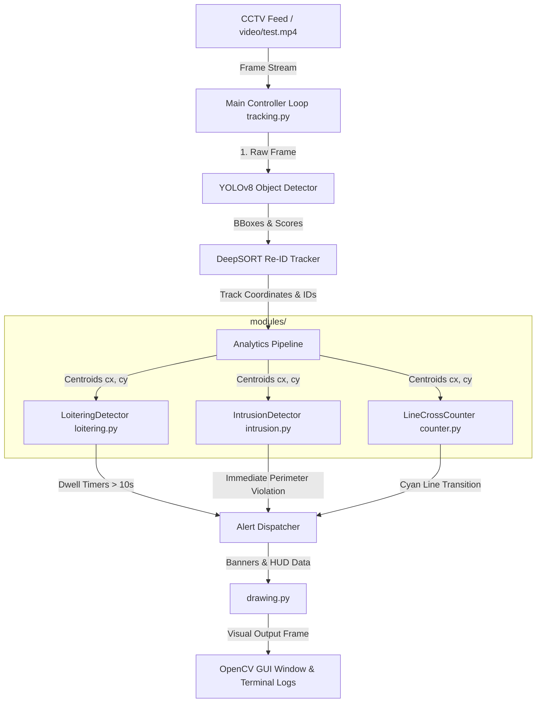

# Intelligent CCTV Video Analytics Pipeline

[](https://opensource.org/licenses/MIT)
[](https://www.python.org/)
[](https://github.com/ultralytics/ultralytics)
[](https://github.com/levansim/deep_sort_realtime)

An industry-grade, modular, real-time Computer Vision security suite implementing object detection, multi-object tracking, loitering analysis, perimeter intrusion detection, and line-crossing crowd count analytics on live CCTV streams.

---

## 1. Professional Project Architecture Diagram

Below is the modular processing dataflow. High-level frame feeds pass sequentially through deep learning detectors, visual trackers, and parallel stateful security modules before rendering to the display.



---

## 2. Project Folder Structure

The project conforms to clean Python packaging standards, separating configuration, analytics modules, and presentation helper utilities from the main running script:

```text
Smartsurveilance/
├── modules/
│   ├── __init__.py           # Package registration file
│   ├── config.py             # Global constants, paths, thresholds, and colors
│   ├── loitering.py          # Stateful class for dwell time tracking and loiter alarms
│   ├── intrusion.py          # Stateful class for immediate perimeter intrusion alerts
│   ├── counter.py            # Stateful class for line crossing direction and occupancy
│   └── drawing.py            # OpenCV visualization overlays, HUD overlays, and alerts
├── video/
│   └── test.mp4              # Test footage (CCTV simulation stream)
├── detect.py                 # Baseline vanilla frame-by-frame YOLOv8 detector
├── tracking.py               # Main high-level execution script (Entry Point)
├── pyrightconfig.json        # Pyright compiler path overrides
└── README.md                 # Project documentation
```

---

## 3. Problem Statement

Standard surveillance architectures rely heavily on human security operators monitoring multiple grid feeds simultaneously. This setup is highly prone to human fatigue, leading to missed security breaches, slow response times, and an inability to gather quantitative data like retail footfall metrics, zone dwell times, and building occupancy counts. There is a critical need for an automated, edge-capable, multi-threaded video intelligence system that parses video feeds in real-time, alerts on security hazards, and counts crowds without human intervention.

---

## 4. Objectives

*   **Real-time Pedestrian Tracking:** Achieve persistent tracking of pedestrians across frames, maintaining object identity (ID persistence) during cross-overs or short-term occlusion.
*   **Perimeter Protection:** Monitor custom geographic regions of interest (Restricted Areas) and raise immediate, duplicate-safe visual and console alerts upon breach.
*   **Vagrancy/Loitering Prevention:** Track dwell times of persons lingering within critical zones (Loiter Zones) and trigger an alert if a person remains inside for more than 10 seconds.
*   **Crowd Flow Analytics:** Calculate pedestrian movement across a virtual tripwire (counting line) to count entrants and exits, compiling a real-time net occupancy count of the monitored site.
*   **Modular Architecture:** Maintain production-grade clean code following OOP principles, separating model prediction, spatial state tracking, and UI drawing components.

---

## 5. System Workflow

1.  **Ingestion:** The system starts a video capture stream using `cv2.VideoCapture` from a live camera or local file.
2.  **Detection:** YOLOv8 extracts bounding boxes (`xyxy` format) and confidence scores for class `0` (Person).
3.  **Tracking:** DeepSORT assigns unique tracking IDs and filters out noise based on Kalman filters and appearance feature descriptors.
4.  **Spatial Calculation:** The system computes the ground contact centroid coordinate (bottom-center of bounding boxes) for each active track.
5.  **Analytics Evaluation:**
    *   **Loitering Check:** Calculates duration inside the Yellow zone boundary.
    *   **Intrusion Check:** Evaluates immediate entry into the Red zone boundary.
    *   **Line Crossing Check:** Traces the current Y coordinate against the previous frame's Y coordinate relative to the Cyan line.
6.  **De-duplication & State Maintenance:** Alerts are triggered exactly once per event and states are cleared immediately when the track leaves the camera field of view.
7.  **Visualization:** HUD overlays and dynamic bounding boxes (Green for normal, Orange for timer warning, Red for active alarms) are written to the frame and rendered.

---

## 6. Technology Stack

*   **Programming Language:** Python 3.12
*   **Computer Vision Framework:** OpenCV (Open Source Computer Vision Library)
*   **Object Detection:** YOLOv8 Nano (`yolov8n.pt` weights) by Ultralytics
*   **Object Tracking:** DeepSORT (Deep Simple Online and Realtime Tracking) via `deep-sort-realtime`
*   **Deep Learning Backend:** PyTorch (leveraging Apple Silicon GPU/MPS where available)
*   **Static Code Analysis:** Pyright / Pylance config integrations

---

## 7. Implementation Details

Each module is designed as an independent unit:
*   `LoiteringDetector`: Maintains local timing states using python `time.time()`, avoiding frame-rate dependency errors.
*   `IntrusionDetector`: Evaluates state transitions of tracks inside red zones, triggering alerts only once per entry.
*   `LineCrossCounter`: Implements set subtraction logic against `entered_ids` and `exited_ids` to track bi-directional pedestrian flow.
*   `drawing.py`: Uses overlay mask matrices and weighted pixel addition (`cv2.addWeighted`) to render premium, translucent zone boxes.

---

## 8. Key Algorithms Used

### A. YOLOv8 (Detection)
YOLOv8 (You Only Look Once) uses an anchor-free convolutional architecture that outputs bounding box coordinates and class probabilities simultaneously. This project runs the lightweight **YOLOv8 Nano** model, optimizing execution speed for edge-computing configurations.

### B. DeepSORT (Tracking & Re-ID)
DeepSORT links bounding boxes across frames using:
*   **Kalman Filter:** Predicts the next spatial position of a bounding box based on velocity and history.
*   **Hungarian Matcher:** Solves the association problem by matching coordinates.
*   **Deep Re-Identification Feature Vectors:** Computes a MobileNetV2 appearance feature vector of the cropped box, matching individuals even if they are briefly occluded behind pillars or other people.

### C. Stateful Loitering Detection
Calculates the spatial overlap between the track centroid and a static bounding polygon:
$$\text{Inside Zone} \iff x_{\text{min\_zone}} \le cx \le x_{\text{max\_zone}} \land y_{\text{min\_zone}} \le cy \le y_{\text{max\_zone}}$$
A timer is initialized at entry: $T_{\text{start}} = t_{\text{current}}$. If $t_{\text{current}} - T_{\text{start}} > \text{threshold}$, the system flags a loitering alert.

### D. Stateful Intrusion Detection
Similar to the zone overlap check, but bypasses the timer accumulator. The alarm flag is set immediately:
$$\text{Intrusion Alert} \iff \text{Centroid} \in \text{Restricted Zone} \land \text{Track ID} \notin \text{intrusion\_alerted}$$
The alert status is reset as soon as $\text{Centroid} \notin \text{Restricted Zone}$.

### E. Tripwire Crossing Math (Hysteresis)
A tripwire boundary is defined at $Y = L_y$. For track $i$, let $y_{t-1}$ be the previous Y coordinate and $y_t$ be the current Y coordinate:
$$\text{Direction} = \begin{cases} \text{ENTRY} & \text{if } y_{t-1} < L_y \le y_t \\ \text{EXIT} & \text{if } y_{t-1} > L_y \ge y_t \end{cases}$$
Double counting is prevented by mapping active IDs into `entered_ids` and `exited_ids` sets. An ID is only counted once for an ENTRY event, and remains in the set until an EXIT event occurs, clearing its entry status and resetting the state machine.

---

## 9. Real-World Applications

*   **Mall Analytics:** Monitor footfall counts at main entrance gates, calculate store conversion rates, and map average customer dwell times in front of displays.
*   **Airport Security:** Secure sterile zones near arrivals/departures, monitor passenger queues in real-time, and flag persons crossing lines backward through baggage claim exits.
*   **Railway Stations:** Prevent platform accidents by alerting when passengers stand past yellow lines or enter train tunnels, and optimize crowd flow metrics during rush hours.
*   **Smart Cities:** Monitor crosswalk safety compliance, automate pedestrian density tracking in public plazas, and detect vehicle lane violations.
*   **Humanitics Video Analytics:** Calculate building occupancy levels in commercial office spaces to dynamically regulate HVAC and ventilation services, reducing corporate carbon footprints.

---

## 10. Limitations

*   **Camera Angle & Perspective:** Centroid math assumes a high-angle, top-down oblique view of the scene. Extreme horizontal camera angles can cause skew in centroid positioning.
*   **Occlusion Blindspots:** If a person is completely hidden behind physical architecture (e.g., massive concrete columns) for longer than the tracker's max age (30 frames), DeepSORT will treat their reappearance as a new object, resetting timers.
*   **Illumination Sensitivity:** Sudden changes in environmental lighting (such as headlights, shadows, or night vision toggles) can momentarily impact YOLOv8 confidence scores.

---

## 11. Future Enhancements

*   **Arbitrary Polygon ROI Zones:** Upgrade the rectangular zones to arbitrary multi-vertex polygons using OpenCV's `cv2.pointPolygonTest`.
*   **Abandoned Bag Detection:** Track object bounding boxes that separate from person tracks and remain stationary for >2 minutes.
*   **Crowd Heatmapping:** Map centroid trajectories over time to compile spatial occupancy heatmaps.

---

## 12. Run the Security Analytics Pipeline

To launch the multi-zone tracking and counting suite:
```bash
python tracking.py
```

*   **Cyan Horizontal Line:** Counts entries (downward crossing) and exits (upward crossing).
*   **Yellow Zone (Left):** Monitors loitering thresholds (10 seconds).
*   **Red Zone (Right):** Monitors restricted area intrusions (immediate).
*   **Top-Right HUD Card:** Displays Entry, Exit, and Occupancy stats.
